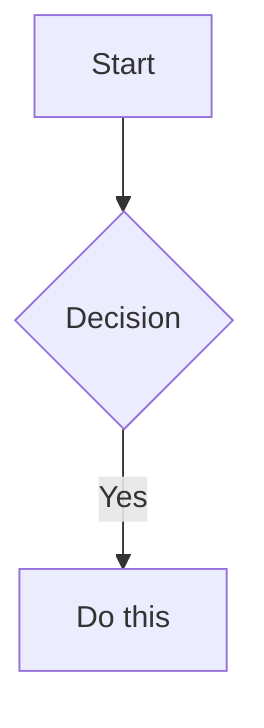

# Obsidian Note Conventions

Formatting and organizational rules for creating notes in the Obsidian vault.

## When This Applies

- Creating new notes via obsidian CLI (`obsidian create`, `obsidian append`, etc.)
- Saving research results, meeting notes, or other content to the vault
- User asks to "write to Obsidian", "save as a note", or similar

## Vault Directory Structure

Directories use numeric prefixes. **Do not guess directory names** -- verify with `obsidian files` or `obsidian folders` before saving.

| Directory | Purpose |
|---|---|
| `00_Inbox/` | Default destination for new files |
| `01_Projects/` | Project-related notes |
| `02_Notes/` | General notes |
| `03_Books/` | Book notes and reviews |
| `05_Private/` | Private notes |
| `99_Tracking/Daily/` | Daily notes (`YYYY-MM-DD.md`) |
| `99_Tracking/Weekly/` | Weekly notes (`YYYY-WNN.md`) |

New files go to `00_Inbox/<filename>.md` unless specified otherwise.

## Note Format

### h1 → filename conversion

Obsidian displays the filename as the note title — h1 headings in the content are redundant and hurt readability.

- If the source content contains `# Title`, **use that text as the filename** (e.g., `# Design Doc - git-prism.nvim` → `Design Doc - git-prism.nvim.md`) and **remove the h1 line** from the content
- If the user has already specified a filename, use that instead (user-specified takes priority)
- Start the note body from `##` (h2)
- Apply **Filename-safe characters** rules below before writing the file

### Filename-safe characters

The vault is synced across macOS / iOS / Android. macOS accepts most characters, but Android's vfat and Windows filesystems forbid `< > : " / \ | ? *` — filenames containing these break sync and become inaccessible on other devices. Always sanitize filenames before calling `obsidian create` / `rename` / `move`.

**Default substitution — ASCII hyphen (`-`)**:

- `:` (especially as a separator like `Foo: Bar`) → ` - ` (space-hyphen-space)
- `/` and `\` → `-` (always — path separators never allowed in the basename)
- `"` in English-only titles → remove, or rewrite with `-`
- `<` `>` `|` `?` `*` → `-` when they are not load-bearing

**Exception — full-width equivalent when ASCII substitution would break the title's meaning**:

| ASCII | Full-width | Use when |
|---|---|---|
| `:` | `：` | Ratios, times, references (e.g. `Ratio 1:2`, `10:30 Standup`) where `-` would change meaning |
| `"` | `「...」` (Japanese) | A quoted phrase inside Japanese text |
| `*` | `＊` | Stylistic/intentional asterisk in the title |
| `?` | `？` | Question mark is semantically required |
| `\|` | `｜` | Pipe is a visual separator the author chose |
| `<` / `>` | `＜` / `＞` | Angle brackets are meaningful (rare) |

Never use full-width for `/` or `\` — they are always `-`.

Judge in context. The rule is "preserve the title's meaning with the least intrusive substitution" — default to `-`, escalate to full-width only when `-` would distort it.

**Examples**:

- `# Design Doc: git-prism.nvim` → `Design Doc - git-prism.nvim.md` (`:` is a separator, hyphen works)
- `# Ratio 1:2 comparison` → `Ratio 1：2 comparison.md` (`:` is a ratio operator, hyphen would destroy meaning)
- `# "The Essence of Software" 読書メモ` → `「The Essence of Software」 読書メモ.md` (quotes around a title inside Japanese text)
- `# All You Need Is *` → `All You Need Is ＊.md` (`*` is intentional stylization)
- `# src/parser.ts バグ修正` → `src-parser.ts バグ修正.md` (`/` always becomes `-`)

### Frontmatter

Every note starts with YAML frontmatter based on `Templates/Note_Template.md`. **Leave all fields empty** — the user fills them in later. **Do NOT populate `tags` or `description`**, even if you know appropriate values:

```yaml
---
aliases:
tags:
description:
---
```

### Example

For a file named `Meeting Notes 2026-03-07.md`:

```markdown
---
aliases:
tags:
description:
---

## Attendees

- Alice, Bob, Charlie

## Discussion

Key points discussed...
```

## Workflow Examples

**New research note**: Create in `00_Inbox/`, use descriptive filename, add empty frontmatter, structure with h2 sections.

**Daily note**: Follow existing daily note patterns in the vault. Check `Templates/` for daily note template if available.

**Project note**: If a project directory exists under `01_Projects/`, save there. Otherwise, use `00_Inbox/` and let the user refile.

## Obsidian Flavored Markdown Syntax

OFM extensions on top of CommonMark/GFM. Standard Markdown is assumed knowledge.

> Adapted from [kepano/obsidian-skills](https://github.com/kepano/obsidian-skills) (MIT). Spec: [Obsidian Flavored Markdown](https://help.obsidian.md/obsidian-flavored-markdown).

### Internal Links (Wikilinks)

```markdown
[[Note Name]]                  Link to note
[[Note Name|Display Text]]     Custom display text
[[Note Name#Heading]]          Link to heading
[[Note Name#^block-id]]        Link to block
[[#Heading in same note]]      Same-note heading link
```

Define a block ID by appending `^block-id` to any paragraph:

```markdown
This paragraph can be linked to. ^my-block-id
```

`[[wikilinks]]` for in-vault notes (rename-tracking); `[text](url)` for external URLs.

### Embeds

Prefix any wikilink with `!` to embed its content inline:

```markdown
![[Note Name]]                 Embed full note
![[Note Name#Heading]]         Embed section
![[image.png|300]]             Embed image (width)
![[document.pdf#page=3]]       Embed PDF page
```

See [EMBEDS.md](references/EMBEDS.md) for audio, video, list, and search-result embeds plus external images.

### Callouts

```markdown
> [!note]
> Basic callout.

> [!warning] Custom Title
> Callout with a custom title.

> [!faq]- Collapsed by default
> Foldable callout (- collapsed, + expanded).
```

Common types: `note`, `tip`, `warning`, `info`, `example`, `quote`, `bug`, `danger`, `success`, `failure`, `question`, `abstract`, `todo`.

See [CALLOUTS.md](references/CALLOUTS.md) for the full list with aliases, nesting, and custom CSS callouts.

### Properties (Frontmatter Syntax)

```yaml
---
title: My Note
date: 2024-01-15
tags: [project, active]
aliases: [Alternative Name]
cssclasses: [custom-class]
---
```

Default keys: `tags` (searchable labels), `aliases` (alt names for link suggestions), `cssclasses` (CSS classes).

See [PROPERTIES.md](references/PROPERTIES.md) for all property types and tag syntax rules.

> **Vault policy** (this repo): create notes with `aliases:` / `tags:` / `description:` **left empty** — see the [Frontmatter](#frontmatter) section above. PROPERTIES.md is a syntax reference for cases where the user later fills in values.

### Tags

Inline tags: `#tag`, `#nested/tag`. Allowed chars: letters, numbers (not first), `_`, `-`, `/`. Can also be declared under frontmatter `tags`.

### Comments

```markdown
This is visible %%but this is hidden%% text.

%%
This entire block is hidden in reading view.
%%
```

### Highlights

```markdown
==Highlighted text==
```

### Math (LaTeX)

```markdown
Inline: $e^{i\pi} + 1 = 0$
Block: $$ \frac{a}{b} = c $$ (delimiters on their own lines)
```

### Diagrams (Mermaid)

````markdown

````

Link Mermaid nodes to Obsidian notes via `class NodeName internal-link;`.

### Footnotes

```markdown
Text with a footnote[^1].

[^1]: Footnote content.

Inline footnote.^[This is inline.]
```

Official spec: [Links](https://help.obsidian.md/links) / [Embeds](https://help.obsidian.md/embeds) / [Callouts](https://help.obsidian.md/callouts) / [Properties](https://help.obsidian.md/properties).
